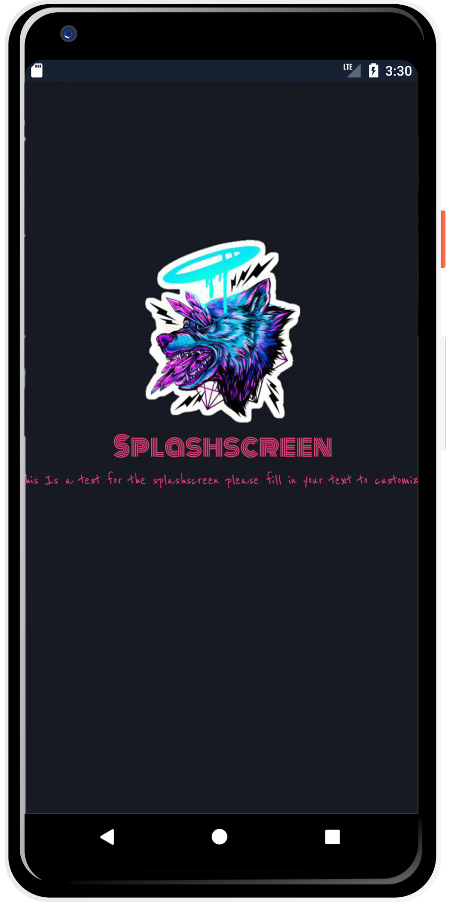

## <p align="center">ANDROID SPLASH SCREEN<p>

## DESCRIPTION

This is and easy to use Splashscreen for android with rotation added that allows you to set time taken to rotate to and direction!

<p align="center">

<p>


## LIBRARIES TO NOTE.

1. **[Picasso](https://github.com/square/okhttp)**

- Picasso was used to display the image logo.

- **Picasso** is an image library for **Android**.It caters to image loading and processing. It simplifies the process of displaying images from external locations


2. **[ButterKnife](http://jakewharton.github.io/butterknife/)**

- **Android Butterknife** is a **view binding tool** that uses annotations to **generate boilerplate code** for us.

## THINKS TO NOTE WHILE INTEGRATING!

1. Include the appropriate dependency (or dependencies) listed below in your `app/build.gradle` file.

```
dependencies {
    implementation 'com.jakewharton:butterknife:8.8.1'
    annotationProcessor 'com.jakewharton:butterknife-compiler:8.8.1'
}
```

2. Add The **Main Activity** and **Splashscreen** classes to your project with their xml layouts **activity_main.xml** & **activity_splash_screen.xml**.

- Note that for animations to work the contents must be inside a Linear Layout.

3. For the Image rotation to work You need to add your selected image to the drawable folder. `app/src/main/res/drawable`

- Set the name as we will be adding the image to our **xml** layout.

4. Change the selected image in the **activity_splash_screen.xml** and replace it with the named one added in step 3 above.

```
<ImageView
            app:srcCompat="@drawable/wolflogo"/>
```

- Replace **wolflogo** with the name of the image you want to use.

5. Add animations using the **anim** folder which contains **downtoup.xml** & **uptodown.xml**.

- From this files you can control the **animation setting**.

- You can also set the **duration** as demonstrated below.

```
<?xml version="1.0" encoding="utf-8"?>
<set xmlns:android="http://schemas.android.com/apk/res/android">
    <translate android:toYDelta="0%p"
        android:fromYDelta="100%p"
        android:duration="3000"/>

</set>
```

6. Locate the **font folder** from `app/src/main/res/` and add it in the same location on your project.

- We shall use it to make the Splash screen more appealing.

7. On the **Android Manifest** set the order of loading of activities to **start with Splash Screen**.

```
        <activity android:name=".SplashScreen">
            <intent-filter>
                <action android:name="android.intent.action.MAIN" />

                <category android:name="android.intent.category.LAUNCHER" />
            </intent-filter>
        </activity>
        <activity android:name=".MainActivity"></activity>
```

- This Will cause the **splash screen** to be load first as the **application launches**. 

8. Depending on the the **Theme** you are using you may want to remove the Action Bar from the Splash Screen just incase your app Theme is set to have an **Action Bar**

- Use whichever seems best to you as for this Demo changes were made in the `app/src/main/res/values/style.xml`

```
    <style name="AppTheme" parent="Theme.AppCompat.Light.NoActionBar">
    </style>
```

- **No Action Bar** was used to set as seen above as it now is `Theme.AppCompat.Light.NoActionBar`

9. Include the colors listed below in your `app/src/main/res/values/colors.xml`. To get the set designed layout of the Splash Screen. 

- Feel free to change the design after you run the project.

```
<?xml version="1.0" encoding="utf-8"?>
<resources>
    <color name="colorPrimary">#262938</color>
    <color name="colorPrimaryDark">#181A24</color>
    <color name="colorAccent">#FF4081</color>
    <color name="colorTransparentPink">#FF9EA1</color>
    <color name="colorWhite">#FFFFFF</color>
    <color name="colorTransparentWhite">#cccccc</color>
    <color name="colorStandardBlack">#262626</color>
    <color name="colorDarkBlue">#001621</color>
    <color name="colorCyanBlue">#0B9BE2</color>
    <color name="colorMidBlue">#032B3F</color>
    <color name="colorCoinBackground">#01242b</color>
</resources>
```


10. **For a much better understanding go through the [code comments](https://github.com/zecollokaris/Animated-Android-Splash-Screen/blob/master/app/src/main/java/com/splashscreen/splashscreen/SplashScreen.java) in the [Splash Screen class](https://github.com/zecollokaris/Animated-Android-Splash-Screen/blob/master/app/src/main/java/com/splashscreen/splashscreen/SplashScreen.java) and figure how to play around with the Image.**

- Enjoy! Your Splash screen is now ready :smile:

### SPASH PAGE.

<p align="center">

<p>

## PRE-REQUISITES.

A couple of things to get you started:

1. Ensure you have [Java](https://java.com/en/download/) installed

A simple way to install Java is using [sdkman](https://sdkman.io/).

Simply follow the instructions to have _sdkman_ installed and install java:

```bash
sdk install java
```

2. [Gradle](https://gradle.org/)

Gradle is used as the build tool and can be installed with sdkman:

```bash
sdk install gradle
```

3. [Android SDK](https://developer.android.com/studio/)

Android SDK used to provide all the necessary developer tools to build, test, and debug apps for Android in Windows, Mac or Linux.

4. [Android Build Tools](https://developer.android.com/studio/releases/build-tools)

Android SDK build tools used to debug, build, run and test an Android application.


## How to contribute

All contributions are welcome, from code to documentation to graphics to design suggestions to bug reports. Please use GitHub to its fullest. Whatever you have to offer, we can use it!


## Support & Contact

- Mobile number: (+254) 798731203

- Email Address: collo.kariss@gmail.com

- github-username: [zecollokaris](https://github.com/zecollokaris)

## LICENSE

This project is licensed under the **MIT License** - see the [LICENSE](LICENSE) file for details.